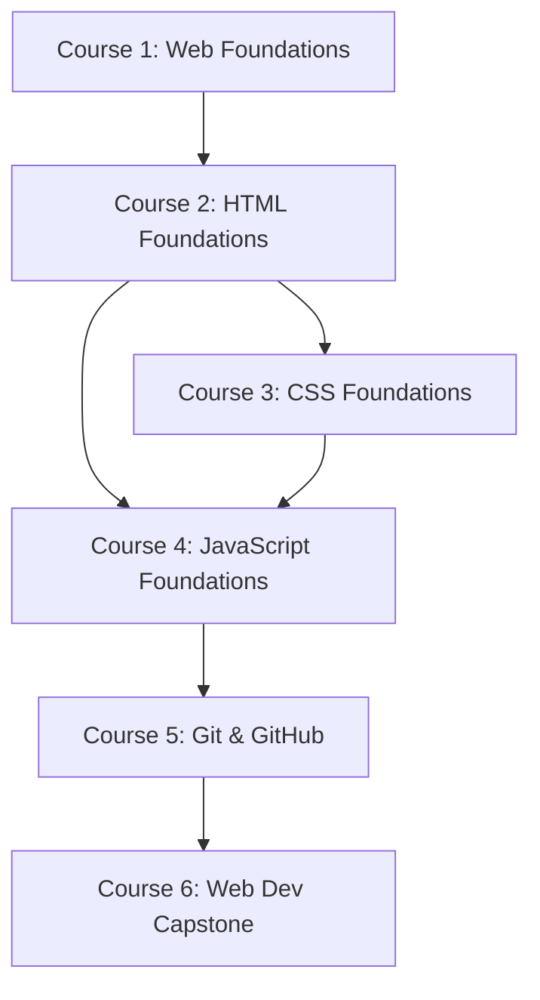

# Prerequisite Graph

This graph defines the strict pedagogical dependencies between capabilities and technologies within the Web Development Foundations path. Cycles are prohibited.

## Course Dependencies



## HTML Concept Dependencies

```text
HTML Document Structure (mod-html-01)
   ↓
HTML Nesting & Elements (mod-html-02, mod-html-03, mod-html-04)
   ↓
HTML Semantics (mod-html-05)
   ↓
Forms & Inputs (mod-html-07)
   ↓
Document Accessibility (mod-html-08)
```

## CSS Concept Dependencies

```text
CSS Selectors & Declarations (mod-css-01)
   ↓
Values & Colors (mod-css-02)
   ↓
CSS Box Model (mod-css-03)
   ↓
Normal Flow & Positioning (mod-css-04)
   ↓
Flexbox (mod-css-05)
   ↓
CSS Grid (mod-css-06)
   ↓
Responsive Design & Media Queries (mod-css-07)
```

## JavaScript Concept Dependencies

```text
Programming Thinking (mod-js-01)
   ↓
Variables (mod-js-02)
   ↓
Operators (mod-js-03)
   ↓
Conditions (mod-js-04)
   ↓
Loops (mod-js-05)
   ↓
Functions & Scope (mod-js-06)
   ↓
Arrays & Objects (mod-js-07, mod-js-08)
   ↓
Debugging (mod-js-09)
   ↓
DOM Selection (mod-js-10)
   ↓
Events & State (mod-js-11)
   ↓
Async & Fetch API (mod-js-13)
```

## Hidden/Cross-Domain Prerequisites

To successfully interact with the DOM in JavaScript, specific HTML and CSS knowledge is assumed:
- **`mod-js-10` (DOM Selection)** depends on understanding **CSS Selectors** (taught in `mod-css-01`).
- **`mod-js-10` (DOM Manipulation)** depends on understanding **HTML Tags, Classes, and IDs** (taught in `mod-html-01` to `mod-html-03`).
- **`mod-js-11` (Forms & State)** depends on understanding **HTML Forms and Inputs** (taught in `mod-html-07`).

To successfully style an interface with CSS, specific HTML knowledge is assumed:
- **`mod-css-01` (CSS Selectors)** depends on understanding **HTML Tags, Classes, and IDs**.
- **`mod-css-03` (CSS Box Model)** depends on understanding **HTML Block vs Inline defaults**.
