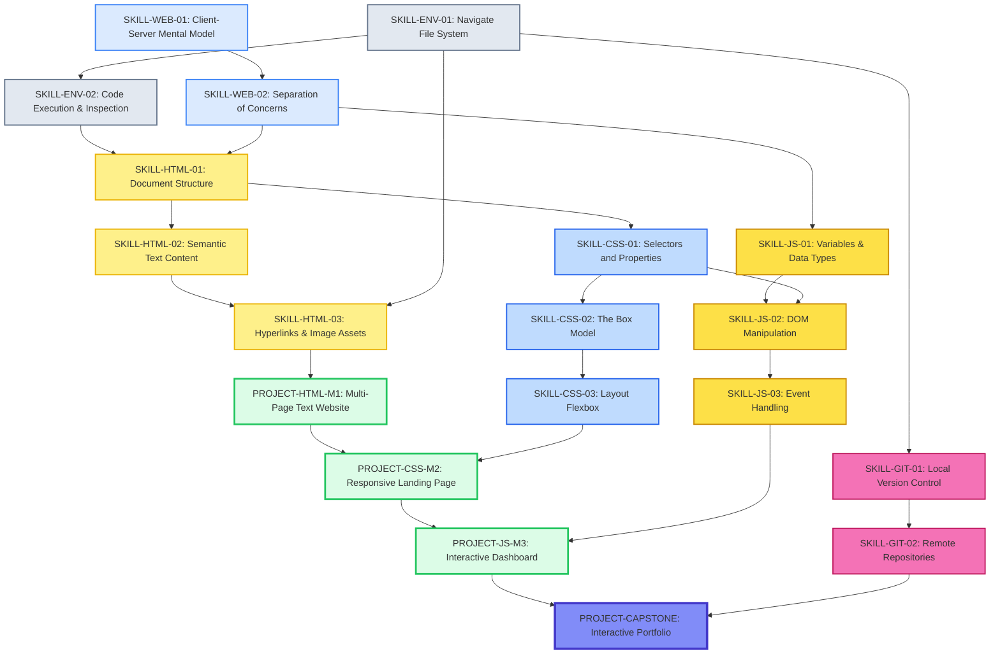

# PREREQUISITE GRAPH: Vertical Slice (Phases 0, 1, and HTML Module 1)

This graph maps the dependencies between concepts to prevent arbitrary topic sequencing. A node must be completely taught and practiced before its dependents are introduced.

## Dependency Rationale

1. **Why `ENV-01` before `ENV-02`?**
   Students cannot open a project in an IDE if they do not understand how to locate or create a folder in their file system.

2. **Why `WEB-02` before `HTML-01`?**
   Before writing HTML boilerplate, students must understand *why* HTML exists (to provide structure) as distinct from CSS (presentation).

3. **Why `HTML-02` before `HTML-03`?**
   Hyperlinks and images are inline elements that often sit *inside* structural block elements (like paragraphs). Students must understand text structure before they can embed media within it.

4. **Why `ENV-01` before `HTML-03`?**
   Linking to other local HTML pages or embedding local images requires an understanding of file paths (relative vs. absolute), which relies heavily on file system navigation skills learned in Phase 0.

5. **Why `CSS-01` before `JS-02`?**
   To query the DOM effectively in JS (`document.querySelector('.btn')`), students must first understand how CSS selectors work.

6. **Why `WEB-02` before `JS-01`?**
   Students need the mental model of the Frontend Trinity to understand why we are writing logic in a new language separate from HTML.
