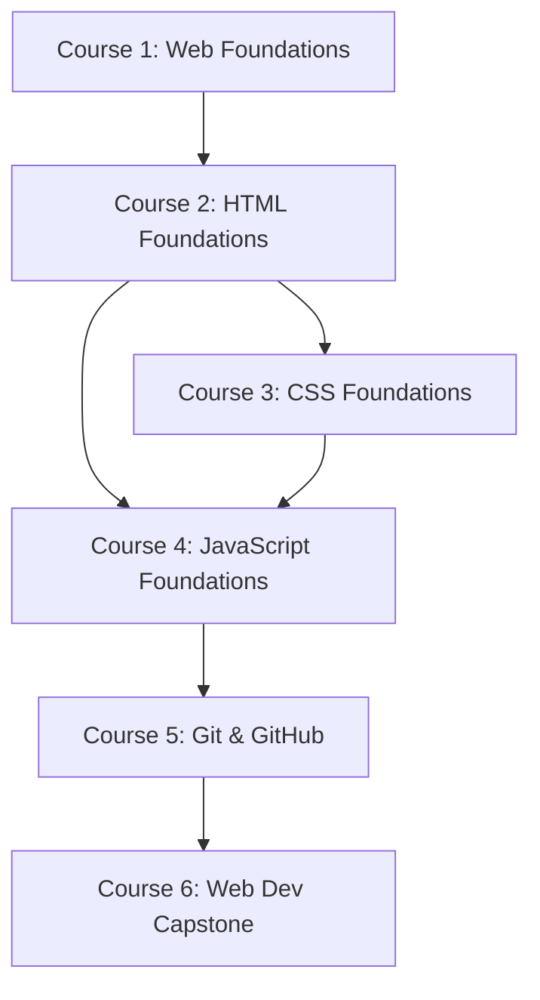

# Prerequisite Graph

This graph defines the strict dependencies between capabilities and technologies within the Web Development Foundations path. Cycles are prohibited.

## Course Dependencies



## HTML Concept Dependencies

```text
HTML Document Structure
   ↓
HTML Nesting & Elements
   ↓
HTML Semantics
   ↓
Forms & Inputs
   ↓
Document Accessibility
```

## CSS Concept Dependencies

```text
CSS Selectors & Declarations
   ↓
Values & Colors
   ↓
CSS Box Model (Margin/Border/Padding)
   ↓
Normal Flow & Positioning
   ↓
Flexbox
   ↓
CSS Grid
   ↓
Responsive Design & Media Queries
```

## JavaScript Concept Dependencies

```text
Values & Types
   ↓
Variables
   ↓
Operators
   ↓
Conditions
   ↓
Loops
   ↓
Functions & Scope
   ↓
Arrays & Objects
   ↓
DOM Selection
   ↓
DOM Manipulation
   ↓
Events & Forms
   ↓
Async & Fetch API
```

## Hidden/Cross-Domain Prerequisites

To successfully interact with the DOM in JavaScript, specific HTML and CSS knowledge is assumed:
- **`document.querySelector('.btn')`** depends on understanding **CSS Selectors** (taught in CSS-01).
- **`element.classList.add('hidden')`** depends on understanding **CSS Classes and Display** (taught in CSS-04).
- **Form Event Listeners** depend on understanding **HTML Forms and Inputs** (taught in HTML-07).

To successfully style an interface with CSS, specific HTML knowledge is assumed:
- **CSS Selectors** depend on understanding **HTML Tags, Classes, and IDs**.
- **CSS Box Model** depends on understanding **HTML Block vs Inline defaults**.
